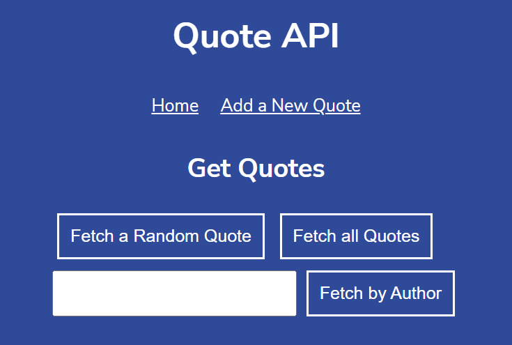
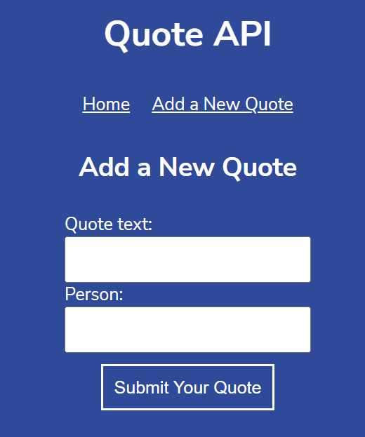

# Express.js - Quote Api

## Project Description

In this project, I have built a small Express.js web API to store and serve different quotes about computers, coding, and technology located in ```data.js```.

<br>

## Project Goals

The project had to satisfy the following requirements:

 - the server should listen on port 4001
 - the api should have a ```GET /api/quotes/random``` route that sends back a random quote
 - the api should have a ```GET /api/quotes route``` 
   -  if the request has no query params, this route should return all available quotes; 
   - if there is a query string with a person attribute, this route should return all the quotes attributed to the specified person; 
   - if there are no quotes for the requested person, an empty array should be returned
 - the api should have a ```POST /api/quotes``` route for adding new quotes to the data; 
   - if the request query string contains the correct parameters, this route handler adds the new quote object to the data array and sends back an appropriate 'success' response; 
   - if the query string does not contain the requisite parameters, a 400 'bad request' response is returned

Optional features:

  - include a ```PUT``` route for updating quotes
  - include a ```DELETE``` route for deleting quotes
  - include the year of each quote

<br>

## Installing / Getting started

In order for this app to work, user needs to have node installed and enter following into console:

```
node server.js
```

upon entering, the server is created and located at ```http://localhost:4001/```, with which can user freely interact.

<br>

## Developing

In order to develop further functionalities, a developer needs to first install following dependencies: 

```shell
npm install
npm install express
```

After installing these dependencies, developer may add additional features inside ```server.js``` for additional routes and so on.

<br>

## Project Status
*In progress...*

- Main features (POST, GET) implementd

- ***Optional features(PUT, DELETE) to be implemented...***

<br>

## Features

Project consists of 2 web sites:

**Home page**



<br>

**Add a New Quote**



<br>
<br>

### **On Main page:**

- **Fetch a Random Quote** button will render a random quote from `data.js` with author and text of such quote
- **Fetch all Quotes** button will render every quote in `data.js`
- **Fetch by Author** button will render a quote depending on author provided. If there is no such author `Your request returned no quotes.` will be rendered instead.

<br>

### **On Add a New Quote:**
- User can type a quote and author into specified input fields and by pressing **Submit Your Quote**, quote is added into database of all quotes(Note: At this time there is no database implemented, so all newly added quotes will be lost after refreshing page). Also user is not able add exactly same quote(same author and same quote text) twice. So if there is already the exactly same quote in database, It will not be added.

<br>

## Technologies used
The project was created with:
 - ES6 JavaScript
 - Node.js
 - Express.js
 - HTML
 - CSS


<br>

## Acknowledgements
This project was created as a part of [Codecademy](https://www.codecademy.com/) Full-Stack Engineer Career Path.  

<br>

## Licensing

"The code in this project is licensed under MIT license."
